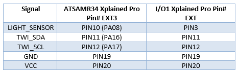

# ATSAMR34_LORAWAN_I2C_SENSOR
> Adding IO1-XPRO sensors to ATSAMR34 Xplained Pro board

This sample code read light and temperature sensors from the ATIO1-XPRO and transmit data to the LoRaWAN(tm) network.

For more information on Microchip ATSAMR34 LoRa SiP and ATIO1-XPRO, visit Microchip webpages:  
https://www.microchip.com/design-centers/wireless-connectivity/low-power-wide-area-networks/lora-technology/sam-r34-r35
https://www.microchip.com/developmenttools/ProductDetails/ATIO1-XPRO

## Get a Microchip ATSAMR34 Xplained Pro evaluation kit

The ATSAMR34 Xplained Pro evaluation kit is a hardware platform used to evaluate the ATSAMR34 Low Power LoRa® Sub-GHz SiP. It is supported by Atmel Studio 7.0 IDE and a collection of sample codes are available from Advanced Software Framework (ASFv3) since the 3.44.0 release.
The Xplained Pro MCU series evaluation kit includes an on-board Embedded Debugger (EDBG), and no external tools are necessary to program or debug the ATSAMR34.
The kit offers a set of features that enable the user to get started with the ATSAMR34 Low Power LoRa® Sub-GHz SiP peripherals right away, and to understand how to integrate the device in your own design.
The ATSAMR34 Xplained Pro kit contains the following items:
- One ATSAMR34 Xplained Pro  
- One external antenna  

https://www.microchip.com/DevelopmentTools/ProductDetails/dm320111

## Get a Microchip IO1 Xplained Pro evaluation kit

I/O1 Xplained Pro is an extension board to the Xplained Pro evaluation platform. I/O1 Xplained Pro is designed to give a wide variety of functionality to Xplained Pro MCU boards including a microSD card, a temperature sensor, a light sensor, and more.

https://www.microchip.com/developmenttools/ProductDetails/ATIO1-XPRO

## Software

- Download and install Atmel Studio 7.0 IDE.  
https://www.microchip.com/mplab/avr-support/atmel-studio-7

- Open Atmel Studio 7.0 IDE.  
- Then, you need Advanced Software Framework (ASFv3) v3.45.0 release or upper release.  
Install ASFv3 as an extension to Atmel Studio from the menu: Tools -> Extensions and Updates …
- Once the installation is complete, you must restart Atmel Studio.  
- Download and install a serial terminal program like Tera Term.  
https://osdn.net/projects/ttssh2/releases/

Note: ASFv3 is an MCU software library providing a large collection of embedded software for AVR® and SAM flash MCUs and Wireless devices. ASFv3 is configured by the ASF Wizard in Atmel Studio 7.0 (installed as an extension to Studio). ASFv3 is also available as a standalone (.zip) with the same content as Studio extension (https://www.microchip.com/mplab/avr-support/advanced-software-framework).

Important:
Until the next Atmel Studio IDE release, you have to manually install the Device Part Pack for developing with SAMR34/R35 on Atmel Studio 7.0 IDE.
(all products released in between IDE releases of Atmel Studio should be manually added by user to develop applications).
- Go to Tools -> Device Pack Manager  
- Check for Updates  
- Search for SAMR34 and click install  
- Repeat the same for SAMR35  
- Restart Atmel Studio 7.0 IDE  

## Hardware Setup

Follow the instructions below to connect SAMR34-Xpro and IO1-Xpro boards together.

## Tutorial

- Start Atmel Studio 7 IDE
- Open this project
- From the Atmel Studio menu, go to: Build -> Build Solution
- Flash the firmware on the ATSAMR34 Xplained Pro board
- Open a Tera Term session with 115200 bps 8N1 configuration.
- Reset the board
- The application will start and on Tera Term the menu is displayed.
- The application starts by joining the LoRaWAN(tm) network with OTAA method and the keys configured.
- When the network is joined, the application will transmit the light and temperature values every 60 seconds to the network through the gateway.
